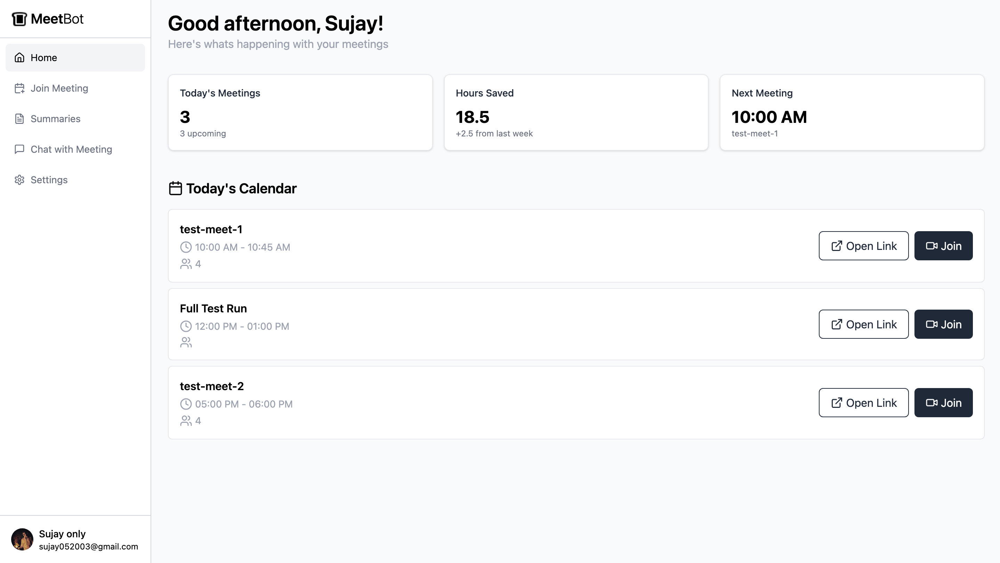
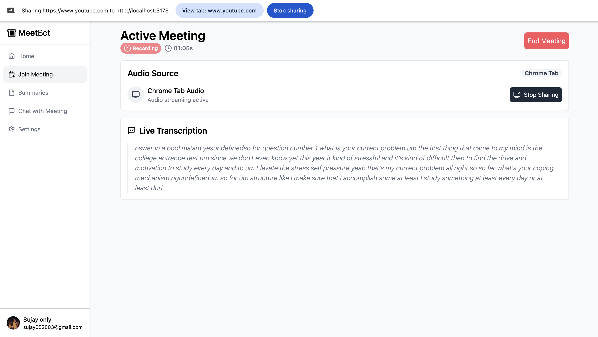
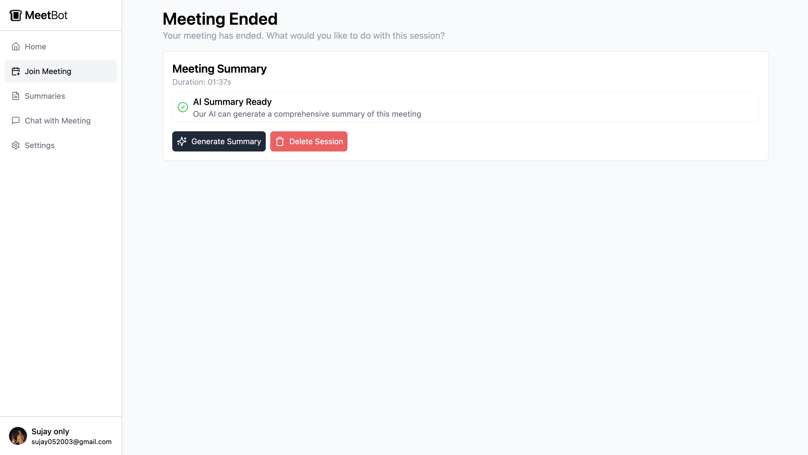
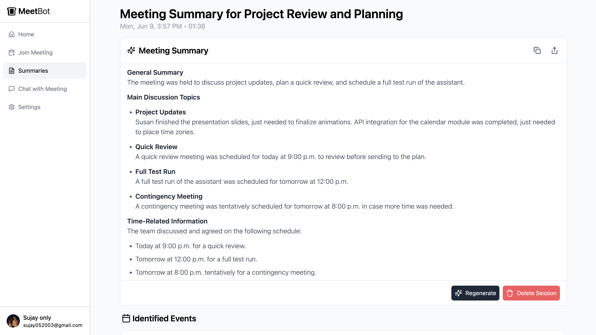
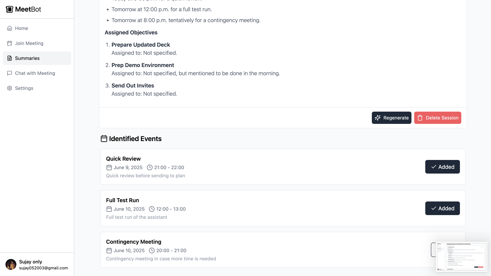
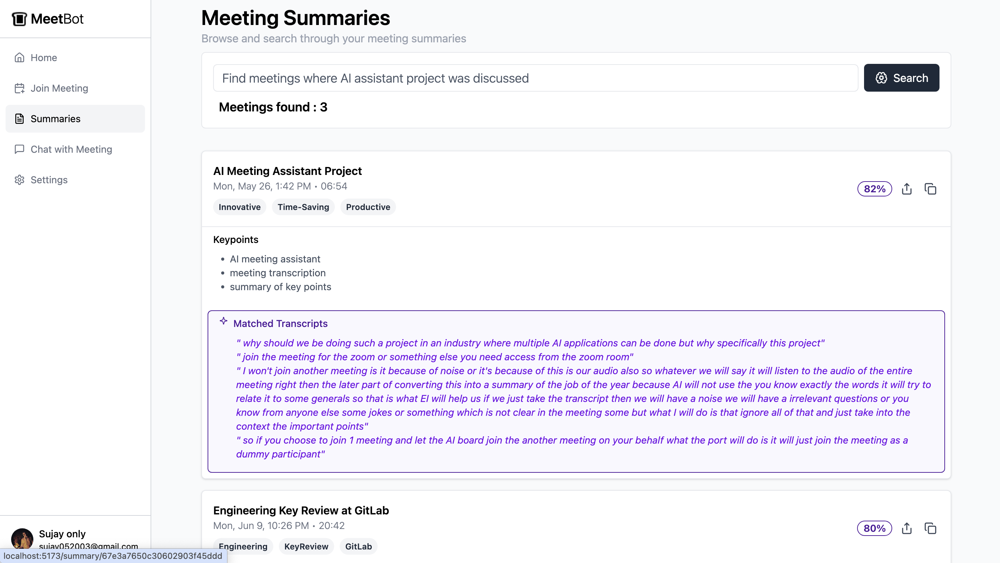
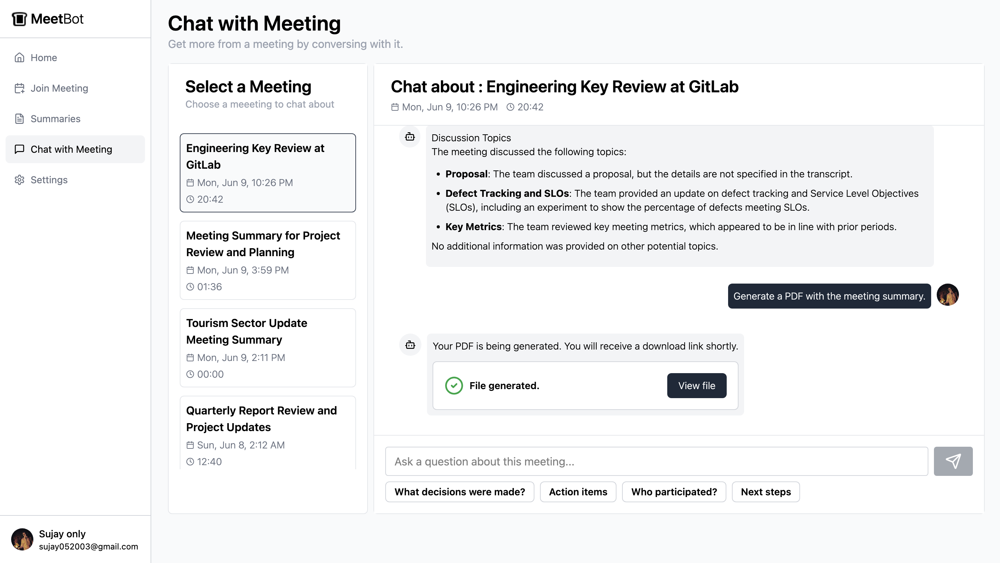
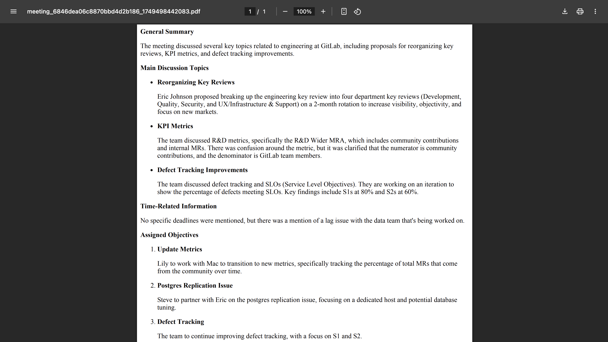
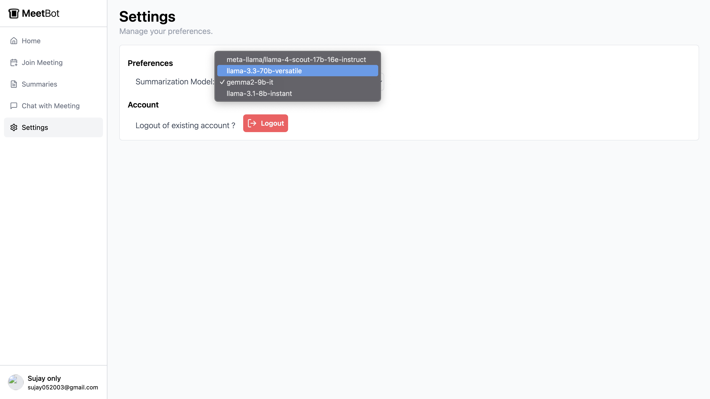

# Meetbot

Meeting summarizer agent.

- Shows real-time transcripts of ongoing meeting.
- Generates minutes of meeting post analysis.
- Automatically identifies events mentioned and schedules them on G-calendar
- Semantic search over past meeting along with chat with meeting-context.
- Generate meeting artifacts like summary , action items in a pdf.

## Views




















## Run Locally

Clone the project

```bash
  git clone https://link-to-project
```

Go to the project directory

```bash
  cd meetbot
```

Install dependencies - server

```bash
  cd server
```

```bash
  nvm use 22.14.0
```

```bash
  npm install
```

```bash
  export GOOGLE_APPLICATION_CREDENTIALS=/path/to/gcloud-key.json
```

Start the server

```bash
  nodemon index.js
```

Install dependencies - client

```bash
  cd client
```

```bash
  npm install
```

```bash
  npm run dev
```
